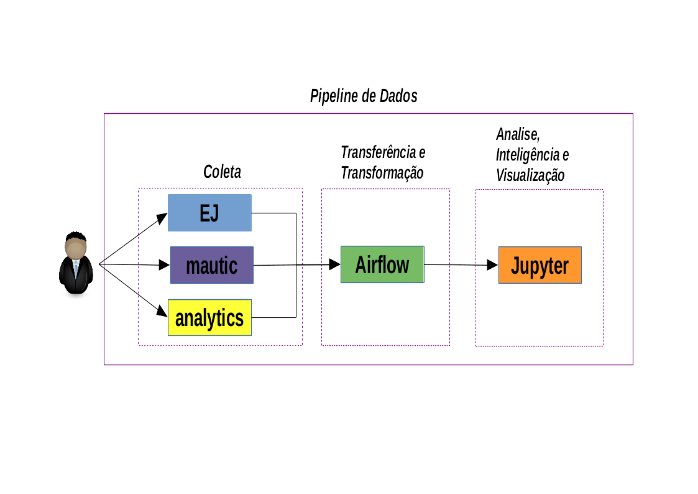

# Visão Geral

Repositório contendo um [DAG](https://airflow.apache.org/docs/stable/concepts.html) do Airflow, 
responsável por coletar dados de voto (via api) na EJ, dados de contato (via api) na plataforma Mautic
e dados de comportamento via api do google analytics. Além de coletar
os dados, o DAG também consolida tais dados em uma estrutura única, utilizada posteriormente
pelo Jupyter, para análises e visualização. O jupyter carrega os dados consolidados pelo
airflow por meio de um volume Docker, compartilhado entre ambas as ferramentas.

Para que o Airflow possa consolidar os dados das três fontes, precisamos que EJ, 
Mautic e Analytics estejam configurados para trabalhar em conjunto. No EJ, a coleta tem de ser feita via o 
[componente de coleta](https://github.com/cidadedemocratica/ej-components). 
O Mautic deverá ter seu script de tracking configurado
na mesma página do componente da EJ. O Analytics terá que ter uma property
configurada para a pagina em que o web component da EJ foi instalado. Todo
usuário que acessar a página do componente, terá o cookie do Analytics salvo
no contato do Mautic, que é criado utilizando esse [script de tracking](https://github.com/cidadedemocratica/ej-server/issues/105).

# Configuração

Para que o Operator, responsável por executar a coleta, consiga conectar tanto na EJ quanto no Mautic,
será preciso criar as conexões definidas no arquivo de `src/ej/.prod.env`. É por meio deste arquivo
que o Airflow irá ter acesso à informações essenciais para sua correta execução.

- **VIEW_ID**: Identificador da `view` da property configurada no analytics para o projeto. Sem esse identificador o Operator nao irá conseguir requisitar os dados de comportamento;
- **MAUTIC_TOKEN**: Basic token em base64, composto por username:senha. Essas credenciais devem ser capazes de logar na instância do Mautic;
- **CONVERSATION_ID**: ID da conversa de onde os votos e comentários serão requisitados;
- **ej_conn_id**: Nome da conexexão criada no Airflow para requisição na api da EJ;
- **mautic_conn_id**: Nome da conexexão criada no Airflow para requisição na api do Mautic;

# Execução

Para subir as instâncias do Airflow e do Jupyter, execute:

	make run env=prod

O Airflow possui autenticação por senha, então você irá precisar criar um usuário administrador no
seu ambiente. O arquivo `src/create_superuser.py`, possui o passo a passo para a criação.
